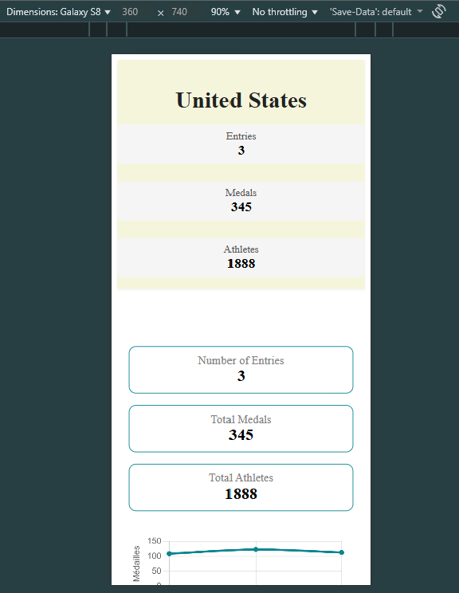
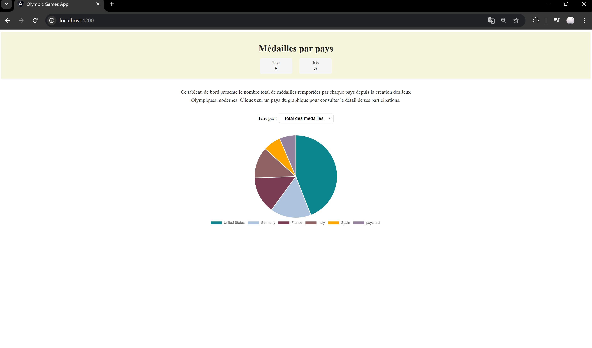
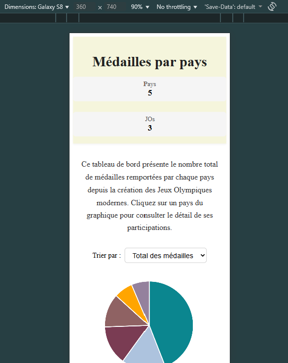
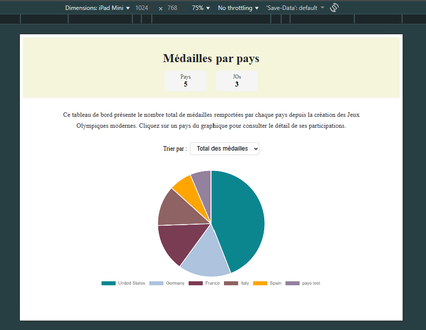

# OlympicGamesStarter

Projet Angular pour visualiser les médailles olympiques par pays.

Ce projet est un starter utilisant **Angular 18** et des données mock JSON pour afficher :

- Un dashboard avec les médailles par pays (graphique camembert)
- Une page de détail par pays avec les participations et l’évolution des médailles
- Un header réutilisable avec KPI

---

## Sommaire

- [Prérequis](#prérequis)
- [Installation](#installation)
- [Fonctionnalités](#fonctionnalités)
- [Bonnes pratiques appliquées](#bonnes-pratiques-appliquées)
- [Architecture / Structure du projet](#Architecture / Structure du projet)
- [Limitations connues](#limitations-connues)
- [Captures d'écran](#Captures d'écran)

---

## Prérequis

- Node.js ≥ 18
- NPM ≥ 8

---

## Installation

1. Cloner le projet:
```bash
  git clone https://github.com/Akima-zed/teleSport
```
2. Installer les dépendances :
```bash
  npm install
```

## Lancer l'application
```bash
  ng serve
````
- Puis ouvrir http://localhost:4200/ dans votre navigateur.
- L’application se recharge automatiquement lors de modifications du code source.

## Fonctionnalités

Dashboard : 
- Graphique en camembert (Chart.js) 
- Tri par pays (ordre alphabétique ou total de médailles)

Page Country Detail :
- Graphique linéaire de l’évolution des médailles
- KPIs : participations, médailles, athlètes

Header réutilisable :
- Présente les indicateurs clés sur chaque page

Gestion des erreurs :
- Message + redirection sécurisée en cas d’ID invalide

Responsive design :
- Desktop ≥ 1200px : 12 colonnes côte à côte
- Tablette 768–1199px : 8 colonnes, graphes pleine largeur
- Mobile ≤ 767px : 4 colonnes, affichage vertical

Chargement :
- Variable loading et *ngIf pour afficher un spinner ou skeleton pendant le fetch


## Bonnes pratiques appliquées

- Typage strict (interfaces, pas de any)
- Observables détruits avec takeUntil
- Gestion des erreurs avec catchError
- Code factorisé et lisible
- Fichiers < 300 lignes
- ActivatedRoute pour récupérer l’ID pays
- Navigation sécurisée pour ID invalide


## Architecture / Structure du projet

## Architecture / Structure du projet

| Dossier / Fichier        | Description                                        |
|--------------------------|----------------------------------------------------|
| app/components/header/   | Composant réutilisable Header                      |
| app/components/Home/     | Home                                               |
| app/components/country/ | Détail d’un pays                                   |
| app/services/            | Services centralisant la logique métier et données |
| app/models/              | Interfaces TypeScript                              |
| app/app-routing.module.ts | Définition des routes                              |
| assets/screenShots/      | Captures d’écran                                   |


## Limitations connues

- Données mock uniquement, pas de backend réel
- Pas de tests unitaires
- Graphiques et styles simples

## Captures d'écran






